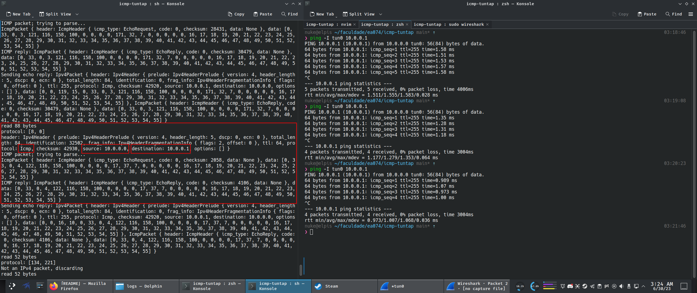
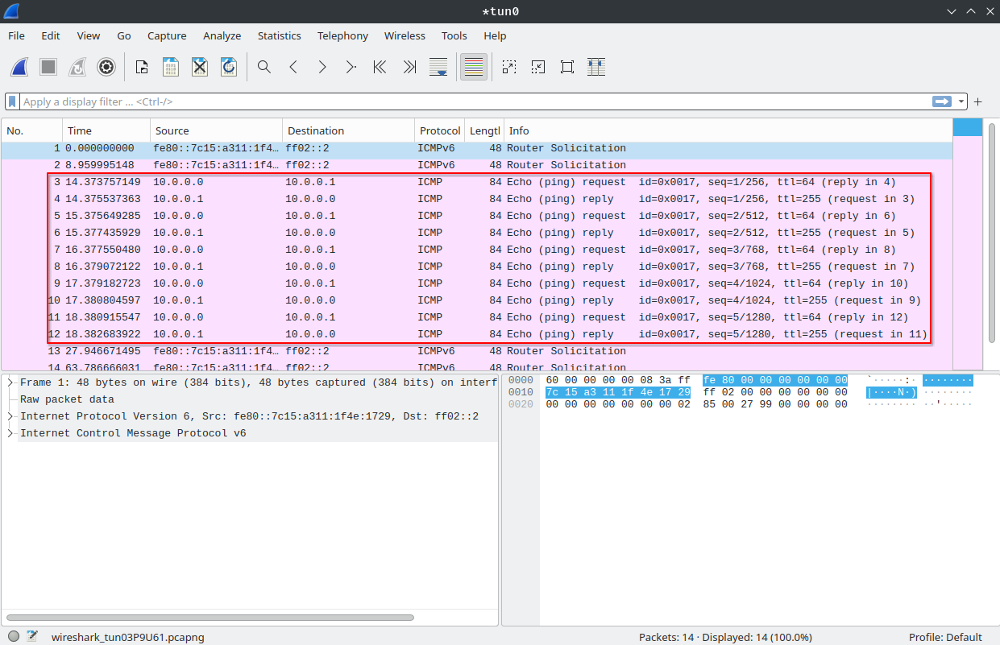

# icmp-tuntap

This is my final project for the course EA074 - Introduction to Computer Networks. It's a very basic implementation of the [ICMP protocol](https://en.wikipedia.org/wiki/Internet_Control_Message_Protocol) over a Linux kernel TUN/TAP device.
It is currently able to reply to pings (ICMP Echo Request messages) from other hosts in the network.

It currently listens to incoming bytes on the TUN/TAP interface, parses all incoming IPv4 packets (discarding the rest) and filters out the ones that carry ICMP payloads. It then decides how to reply to the incoming ICMP packets appropriately (currently sending an `Echo Reply` in response to `Echo Request`).

The program has minimal dependencies (just TUN/TAP bindings for Rust and the [`nom`](https://github.com/rust-bakery/nom) crate for implementing binary parsers) and everything is built from the ground up. 

## Compiling and running

You will need to install the Rust toolchain, either with [rustup](https://rustup.rs/) (recommended) or with your distro package manager. Run the `run.sh` script as `root`:

```
$ sudo ./run.sh
```

I know that running as `sudo` is sketchy, but the script basically does the following:

- Compile the source
- Grant NET_ADMIN capabilities to the executable, we can't create TUN/TAP interfaces without it (needs `sudo`)
- Assign an IP address/subnet to the TUN/TAP interface, currently `10.0.0.0/24` (needs `sudo`)
- Bring up the TUN/TAP interface (needs `sudo`)

## Testing

You can ping an IP within the TUN/TAP subnet to verify that it responds to ICMP pings:

```
$ ping -I tun0 10.0.0.1
```

## Screenshots

Here we can see that we receive, parse and reply to an ICMP Echo Request packet coming from the localhost (10.0.0.0) with destination to 10.0.0.1; the successful pings show that the ICMP/IP packets sent in reply are not malformed.


The same exchange sniffed by Wireshark:

